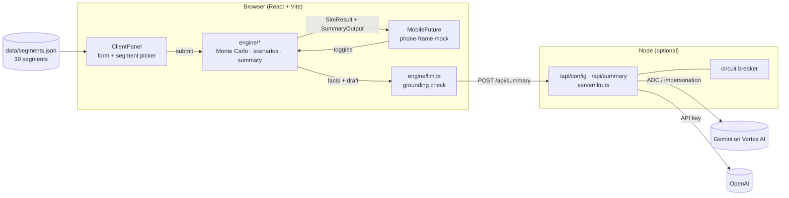

# 1 · Architecture

## Overview

The demo is a single-page React application with a pure-TypeScript simulation/summary engine that
runs **in the browser**, plus a small optional Node process that proxies LLM calls so no credential
ever reaches the client.

## Components

| Layer | Path | Responsibility |
|---|---|---|
| **Engine** | `src/engine/rng.ts` | Seeded RNG (mulberry32) + Box–Muller normal sampler |
| | `src/engine/monteCarlo.ts` | The simulation: N paths × years, percentiles per age, KPIs, bands |
| | `src/engine/scenarios.ts` | Quick-scenario deltas and how they modify engine inputs |
| | `src/engine/pipeline.ts` | One client → baseline sim, toggled sim, 4 scenario readings, 2 lever sims → summary |
| | `src/engine/summary.ts` | Deterministic, templated summary; registers every number it uses in `facts` |
| | `src/engine/grounding.ts` | “Is every number in this text a fact?” — shared by tests and the LLM client |
| | `src/engine/llm.ts` | Browser-side client for the LLM proxy; discards ungrounded replies |
| | `src/engine/types.ts` | `ClientInputs`, `SimInputs`, `SimResult`, `SummaryOutput` (= the UC1 output shape) |
| **UI** | `src/App.tsx` | State: draft vs. submitted client, toggles, run status, LLM mode |
| | `src/components/ClientPanel.tsx` | Segment picker, editable fields, risk presets, **Run outlook** button, dev controls |
| | `src/components/MobileFuture.tsx` | The phone: header, hero KPIs, chart, AI card, toggles, “See more”, disclaimers |
| | `src/components/FanChart.tsx` | Recharts fan chart: P10–P90 / P25–P75 bands, median, retirement marker, tooltip |
| | `src/components/AiSummaryCard.tsx` | Expandable headline → narrative, chips, scenario readings, “Why?” grounding |
| | `src/components/RunStatusGadget.tsx` | Progress gadget: simulating → summarizing → updated |
| | `src/components/OutcomeDistribution.tsx`, `GoalGauge.tsx` | “See more” visualizations |
| **Data** | `src/data/segments.json` | 30 synthetic client segments (stand-in for the segmentation model) |
| **Server** | `server/llm.ts` | Providers (OpenAI, Gemini/Vertex), prompt, `/api` handler, circuit breaker |
| | `server/index.ts` | Standalone backend: CORS, `/healthz`, mounts the handler |
| | `vite.config.ts` | Dev server; mounts the same handler in-process **or** proxies `/api` to `BACKEND_URL` |
| **Ops** | `Makefile`, `.env.example` | Targets that source `.env` for both processes |
| | `scripts/calibrate.ts` | Prints the badge each segment lands on (seed-data QA) |

## Processes and ports

| Process | Command | Port | Notes |
|---|---|---|---|
| Frontend (Vite) | `make frontend` / `npm run dev` | 5173 | Serves the app; mounts `/api` in-process when `BACKEND_URL` is unset |
| Backend (Node) | `make backend` | 8787 | `/healthz`, `/api/config`, `/api/summary`; CORS from `CORS_ORIGINS` |
| Both | `make dev` | 5173 → 8787 | Frontend proxies `/api` to the backend |

Two topologies are supported on purpose: the **one-command demo** (`npm run dev`, everything in
one process) and the **separated** one (`make dev`) that matches how a real deployment would split
UI from an API that holds credentials.

## Key design decisions

1. **Engine in the browser, pure functions.** The Monte Carlo and the summary generator have no React
   or I/O dependencies. They are unit-tested directly, and the same code could run in a Node service
   unchanged. It also makes the demo fully offline.
2. **The LLM never computes; it rewrites.** The templated generator produces a correct, grounded draft
   first. The LLM receives that draft plus a whitelist of facts and a glossary, and is asked to improve
   tone — not to derive anything. See [04](04-ai-summary-and-llm.md).
3. **Grounding is enforced twice.** At build time by tests on the templated generator, and at runtime on
   every LLM reply before it is displayed.
4. **Credentials stay server-side.** The browser only ever calls the local `/api/*` route. Gemini uses
   Google Application Default Credentials (optionally impersonating a service account); OpenAI uses a key
   read by the server. Neither is exposed via `import.meta.env`.
5. **Staged submission.** Form edits are applied on **Run outlook**, so each simulation/LLM call is a
   deliberate, visible event with a progress gadget — not a side effect of every keystroke.
6. **Reproducibility.** Every run is seeded; the same inputs and seed produce identical paths, which
   makes the numbers in a presentation repeatable.

## Technology choices

| Choice | Why |
|---|---|
| React + Vite + TypeScript | Fast dev loop, matches the mobile team’s likely web stack, strong typing for the data contract |
| Recharts | Declarative charts with range areas (bands) out of the box; no custom canvas code |
| Node ≥ 22.18 running `.ts` directly | No build step for the backend; `erasableSyntaxOnly` keeps the code compatible |
| `google-auth-library` | Native handling of ADC, impersonated-SA credential files and explicit impersonation |
| Vitest | Same TypeScript pipeline as Vite; ~0.4 s test runs |

## Output contract

`SummaryOutput` in `src/engine/types.ts` is the UC1 **“Output shape”** from the use-case spec
(`segment_id`, `horizon`, `simulation.{runs, series, kpis}`, `headline`, `narrative`, `highlights`,
`visualizations`, `scenario_readings`, `disclaimers`, plus `why`, `facts`, `source`). The mock and a
future real service are interchangeable at this boundary.
