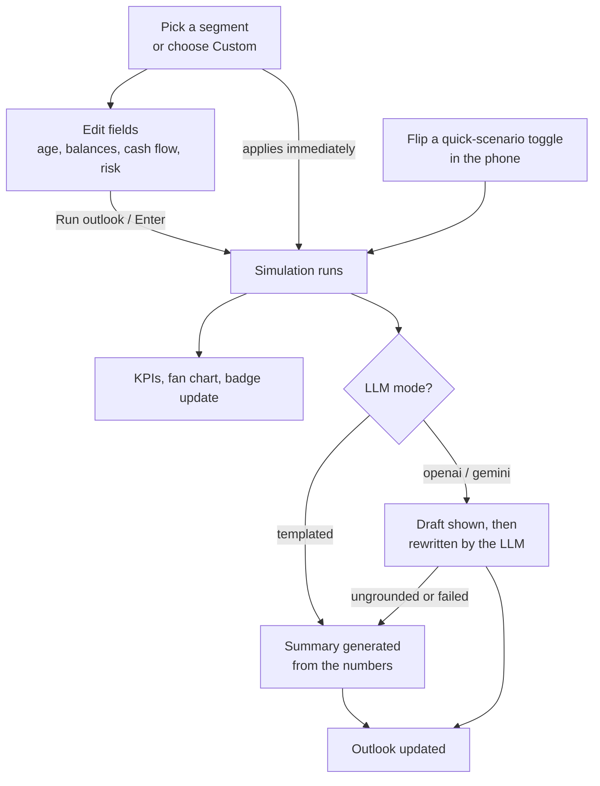
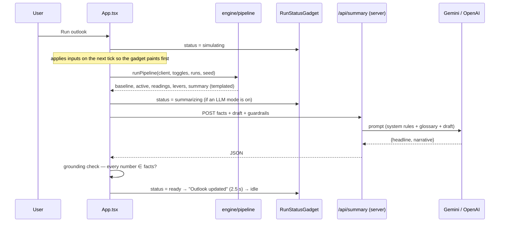

# 2 · Workflow

## The user’s flow

- **Segment selection** applies at once (it is a single, deliberate choice).
- **Field edits are staged.** The form shows *“Unsubmitted changes — press Run outlook (or Enter)”*
  with a Discard option; the button applies them. This keeps every simulation/LLM call an explicit event.
- **Quick-scenario toggles** in the phone apply immediately, exactly like the real app.
- **Dev controls** (runs, seed) also apply immediately.

## What happens on a run (sequence)

### Step by step

1. **Commit.** `App` sets the status to *simulating* and applies the new inputs ~30 ms later, so the
   gadget is on screen before the (synchronous) engine work starts.
2. **Pipeline** (`runPipeline`) runs, in order:
   - the **baseline** simulation (no toggles);
   - the **active** simulation (toggles applied) — identical to baseline when none are on;
   - **four scenario readings**, each single toggle applied to the baseline (Save more, Retire earlier,
     Live longer, Market downturn);
   - **two lever sims** on the baseline (retire 5 years *later*, spend 10 % less) — together with
     “save more” these decide the *biggest lever* sentence;
   - the **templated summary** over the active result.
3. **Render.** Hero KPIs, fan chart, badge, chips and readings update from the active result.
4. **LLM rewrite** (only if `LLM_MODE` is `openai` or `gemini`): the browser posts the `facts`
   whitelist, the templated draft and the guardrails to `/api/summary`. The reply replaces the headline
   and narrative **only if** every number in it is a registered fact; otherwise the draft stays.
5. **Status gadget** at the top of the phone walks through
   *Running 5,000 simulations… → ✓ Simulated 5,000 futures · Writing your summary with Gemini… →
   ✓ Summary written by Gemini · Outlook updated*, then hides after 2.5 s. If the LLM was unavailable
   it says so and notes that the templated summary is shown. The AI card dims while its copy is in flight.

## Where each number on the screen comes from

| Screen element | Source |
|---|---|
| “Retirement at 65 — $974,468” | `kpis.nw_at_retirement` (median path at retirement age) |
| “Legacy at 90: $424,270” | `kpis.nw_at_end` (median at end age) |
| Fan chart | `series[]` per age: p10/p25/p50/p75/p90 (G1–G7) |
| “76 % · Chance money lasts · Borderline” | `kpis.money_lasts_pct`, `kpis.band` (G8) |
| Headline / narrative | templated generator (or its LLM rewrite) over `facts` |
| Chips | chance money lasts · projected NW at 65 · biggest lever (with delta in points) |
| Scenario readings | the four single-toggle simulations |
| “Why?” | the grounding list: starting NW, contributions, spend, real return/vol, runs & seed, medians, withdrawal rate |
| See more → histogram | ending balance of every path, 12 bins up to the 95th percentile |
| See more → gauge | `money_lasts_pct` vs. the 90 % target |
| Footer disclaimers | the three guardrail strings |
