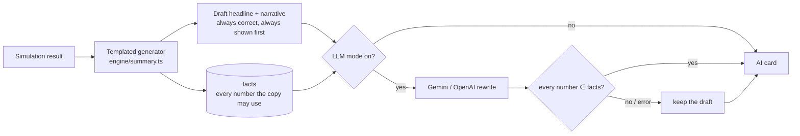

# 4 · AI Summary and the LLM

## Two layers, one guarantee

The **templated generator** is the source of truth. The **LLM** improves wording. Neither layer can
put a number on screen that did not come out of the simulation.

## Layer 1 — the templated generator (`src/engine/summary.ts`)

Deterministic and offline. Before it uses any number it registers it in a `facts` map via a
`use(key, value)` helper; the copy is then composed only from those values. This is what makes the
grounding *provable* rather than hoped for.

What it writes:

| Part | Content |
|---|---|
| **Headline** | tone by band — *“You’re on track — about a 93% chance…”* / *“You’re close — …”* / *“Your plan needs attention — …”* |
| **Narrative (2–4 sentences)** | ① median net worth at retirement with the P25–P75 range; ② band-specific reading — how many scenarios run out, how far above/below the 90 % goal, and (for at-risk) the age the median path runs dry; ③ the **biggest lever** and what it would move the chance to; ④ the **scenario delta** vs. baseline when toggles are on |
| **Highlights (chips)** | chance money lasts (with band) · projected net worth at 65 · biggest lever with its delta in points |
| **Scenario readings** | one sentence per toggle: *“Adding $500 a month raises the chance to about 88%.”* etc. |
| **Why?** | the driving numbers: starting net worth, contributions × years, spending × years, real return & volatility, runs & seed, medians, withdrawal rate |
| **Disclaimers** | *Shown in today’s dollars. · Taxes not modelled. · General information, not advice.* |

**Biggest lever** is chosen by simulation, not by rule: three candidate changes are simulated on the
baseline (save $500/mo more, work 5 more years, spend 10 % less) and the one with the highest
resulting chance wins. If none improves the chance the copy says the plan is already at the ceiling.

**Tone** varies by band and by distance from the 90 % goal (“comfortably above”, “clears”, “N points short”).

## Layer 2 — the LLM rewrite

### What the model receives

- **FACTS** — the whitelist of numbers (plus `band` and `segment_label`).
- **GLOSSARY** — plain-English meaning of each fact key, so the model never echoes internal names
  (*“lever_years”* → *“years of extra work in the retire-later lever”*).
- **DRAFT** — the templated headline and narrative.
- **Rules** (system prompt): every number must be one of the FACTS written exactly (`$974,468`, `76%`);
  keep the draft’s facts, add none; no internal names; second person; match the band’s tone; end with the
  biggest lever as a concrete next step; the three guardrails; return JSON only.

### What it returns, and what happens to it

`{ headline, narrative }` as JSON. The browser (`src/engine/llm.ts`) runs the same grounding check the
tests use: every numeric token in the reply must match a fact (as `1500`, `1,500` or its rounded
form). If any number is not a fact — or the call fails, times out, or returns a malformed shape — the
reply is discarded and the draft stays. The card footer states which copy is shown
(*templated from simulation* / *OpenAI over simulation facts* / *Gemini over simulation facts*).

### Example (real output, GPT-5-nano, 1.6 s)

> **Draft:** You’re close — about a 76% chance your money lasts to 90.
>
> **Rewrite:** You’re close — about a 76% chance your money lasts to 90, and you can push closer by acting now. *In today’s dollars, your plan shows a median net worth at retirement of $974,468, with a typical range from $795,647 to $1,202,937. Across 5,000 simulations, there is a 24% chance your money runs out before 90 while spending $40,800 a year. You’re 14 percentage points shy of the 90% goal. The biggest lever is retirement timing: working 5 more years would move your chance to about 95%.*

All 14 numbers in the rewrite are simulation facts.

## Providers (`server/llm.ts`)

| `LLM_MODE` | Provider | Auth | Notes |
|---|---|---|---|
| `templated` (default) | none | — | fully offline; `/api/summary` answers 503 |
| `gemini` | **Gemini on Vertex AI** (`GEMINI_MODEL`, default `gemini-2.5-flash`) | **Application Default Credentials** — an impersonated-service-account ADC file is handled natively; `GOOGLE_IMPERSONATE_SERVICE_ACCOUNT` layers explicit impersonation on any ADC; no API key | regional or `global` endpoint; thinking minimised (budget 0/128 for 2.5, `thinkingLevel: low` for 3.x+); `responseMimeType: application/json` |
| `openai` | OpenAI Chat Completions (`OPENAI_MODEL`) | `OPENAI_API_KEY` on the server | `reasoning_effort: minimal` for GPT-5 / o-series (1.6 s instead of ~45 s); JSON response format |

`LLM_PROVIDER` is accepted as an alias of `LLM_MODE`.

### Why Gemini needs no key

`google-auth-library` resolves ADC in the standard order (the `GOOGLE_APPLICATION_CREDENTIALS` file,
the gcloud ADC file — including one created with `--impersonate-service-account`, or the metadata
server on GCE/Cloud Run) and mints a short-lived access token for
`…aiplatform.googleapis.com/v1/projects/{project}/locations/{location}/publishers/google/models/{model}:generateContent`.
The project falls back to the ADC/gcloud project if `GOOGLE_CLOUD_PROJECT` is unset. This is the same
impersonation pattern the data-product work uses for EDW.

## Failure handling

| Situation | Behaviour |
|---|---|
| Provider error, timeout, malformed JSON | 502 to the browser → draft kept; error logged with a diagnosis |
| Reply contains a non-fact number | discarded in the browser (`[llm] discarding reply with un-grounded numbers`) → draft kept |
| Quota / auth failure (`insufficient_quota`, `invalid_grant`, `PERMISSION_DENIED`, …) | **circuit breaker**: provider skipped for 10 minutes, 503 immediately, no upstream calls; templated copy in use |
| Gemini reply truncated (`finishReason MAX_TOKENS`) | retried once with `maxOutputTokens: 65536` and minimal thinking; if a model rejects the thinking parameter, retried without it; error reports `thoughts=… output=…` token usage |
| Expired ADC | log hint: *run `gcloud auth application-default login` (add `--impersonate-service-account=…`)* |
| Stale response (inputs changed while a call was in flight) | ignored — responses are keyed to the facts they were generated from |

No output-token cap is sent unless configured (`GEMINI_MAX_OUTPUT_TOKENS` / `OPENAI_MAX_COMPLETION_TOKENS`),
because reasoning tokens count against such caps and were truncating the JSON.

## Compliance posture of the copy

Directly from [`../context/05-projection-engine-assumptions.md`](../context/05-projection-engine-assumptions.md):
general information, not advice · today’s dollars · taxes not modelled · qualitative bands over false
precision · never implies tax treatment the engine doesn’t model. The LLM is told the same rules and
cannot introduce a number to contradict them.
