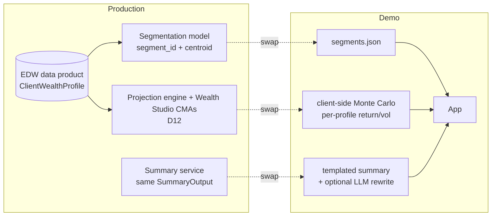

# 7 · Path to Production

The demo was built so that each mocked piece has a single, documented seam.

## Swap-in points

| Demo stand-in | Production component | Seam | Notes |
|---|---|---|---|
| `src/data/segments.json` (30 hand-made segments) | **ML client-segmentation model** — `segment_id`, centroid profile, precomputed baseline (UC1 spec §1) | `SEGMENTS` in `src/App.tsx`; fields map 1:1 to `ClientInputs`, which mirrors the `D#` refs | Features come from the EDW data product (`D1–D8, D10, D14, D20`, `D_MF_INVESTOR_CHAR`) |
| Client-side Monte Carlo with risk-profile presets | **Real projection engine** + **Wealth Studio capital-market assumptions** (`D12`) | `simulate()` / `toSimInputs()` in `src/engine/monteCarlo.ts`; return the same `SimResult` | Per-asset-class return/vol/correlations replace the single return/vol pair; the asset mix becomes an input |
| Templated summary + LLM rewrite | **Summary service** returning the UC1 output shape | `SummaryOutput` in `src/engine/types.ts`; `runPipeline()` | The templated generator and the grounding check are reusable server-side as-is |
| Node dev proxy | Hardened API (auth, rate limiting, logging, PII policy) | `server/llm.ts` handler is framework-free | Keep the circuit breaker and the no-credential-in-client rule |

## Data readiness (from Deliverable A)

Per [`../deliverables/data-product-persona-fields.md`](../deliverables/data-product-persona-fields.md):

- **UC1 is green-only feasible today**: D1, D3, D5, D6 and historical net worth are bound in EDW;
  D2/D4/D10/D11 enrich.
- **UC2/Future engine** is mostly bound; blocked on `D12` (Wealth Studio CMAs callable from mobile?) and
  the tax-scope decision (`D14/D17`).
- Open decisions that change the engine: pre- vs post-tax projection, guaranteed income (`D18/D19`),
  external-account rate of return (`D9`), PAC/ASP frequency normalisation (`D6`).

## Suggested roadmap

| Phase | Scope | Outcome |
|---|---|---|
| **1 · Wire real inputs** | Replace `segments.json` with a read of `ClientWealthProfile` for a signed-in client (D1, D2, D3/D5, D6, D7, D8) | The same UI on real balances; segmentation can still be a stub |
| **2 · Engine parity** | Point `simulate()` at the product’s projection engine; adopt Wealth Studio CMAs; honour the POC’s inputs `I1–I17` and horizons | Chart and KPIs identical to the “My Future” tab |
| **3 · Segmentation** | Train k≈20–30 segments (K-Means/GMM); precompute baseline sim + summary per segment; “clients like you” framing | Fast, consistent summaries; persona catalog for design/testing |
| **4 · Summary service** | Move generator + grounding + LLM rewrite server-side behind the UC1 output shape; add prompt versioning, evaluation set, human review of prompt changes | Auditable, testable copy generation |
| **5 · Compliance & launch** | Legal/compliance review of copy templates and guardrails; PII posture for any future UC3 use; monitoring (grounding-rejection rate, latency, fallback rate) | Production readiness |

## What stays the same

- The **grounding guarantee** and its tests.
- The **guardrail strings** and band thresholds (product decisions already made in the data inventory).
- The **output shape** — the mobile app can integrate against `SummaryOutput` now and never re-integrate.
- The **Gemini auth pattern** (ADC + impersonation), which already matches how the EDW work authenticates.

## Effort signals

The whole demo is ~1.8k lines of TypeScript. The engine and summary layers (~600 lines) are the parts
that would survive into production largely unchanged; the UI is a faithful mock that the mobile team
would re-implement natively.
