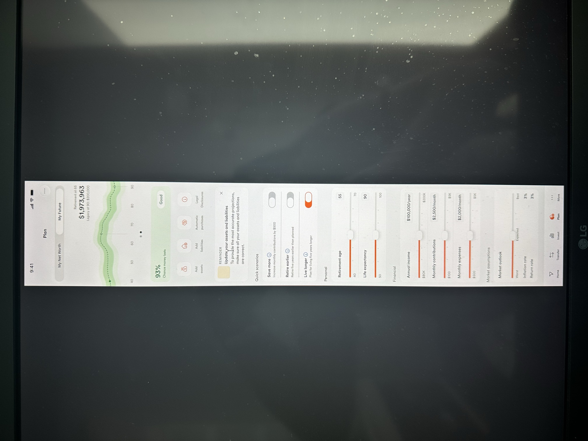
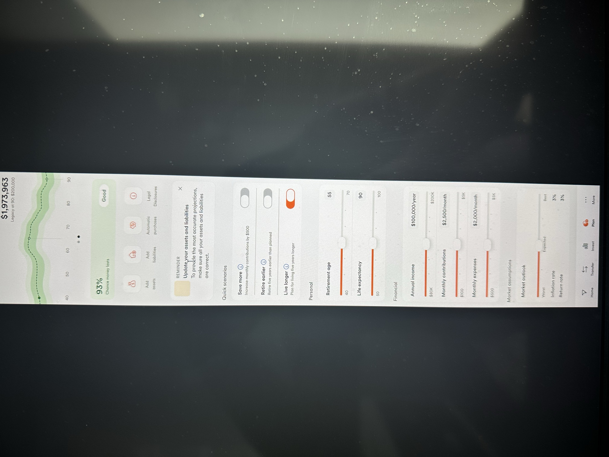

# Design Reference — "My Future" Screen

Photos of the live Tangerine Wealth **"My Future"** mobile screen, captured as part of the source screenshot set (IMG_7400–7401). This is the surface UC1/UC2 layer onto — the demo's phone-frame mock should read like this.

## What's on screen (transcribed)

**Chrome:** status bar `9:41`; header **Plan** (with `…` menu); segmented control **My Net Worth | My Future** (My Future active). Bottom nav: Home · Transfer · Invest · **Plan** (active, orange) · More.

**Headline block**

- "Retirement at 65" → **$1,973,963**
- "Legacy at 90: $200,000"
- Fan/band forecast chart, age axis 40 → 90, median dashed line + green percentile bands, faint vertical retirement marker. Two-dot carousel indicator beneath.

**KPI banner**

- **93%** — "Chance money lasts" — badge **Good** (green).

**Quick actions (icon row):** Add assets · Add liabilities · Automatic purchases · Legal Disclosures.

**Reminder card:** "Update your assets and liabilities — To provide the most accurate projections, make sure all your assets and liabilities are correct." (dismissible)

**Quick scenarios (toggles)**

- Save more — "Increase monthly contributions by $500" — *off*
- Retire earlier — "Retire five years earlier than planned" — *off*
- Live longer — "Plan for living five years longer" — **on** (orange)

**Personal (sliders)**

- Retirement age — **55** (range 40–70)
- Life expectancy — **90** (range 50–100)

**Financial (sliders)**

- Annual income — **$100,000/year** (range $80K–$200K)
- Monthly contributions — **$2,500/month** (range $100–$5K)
- Monthly expenses — **$2,000/month** (range $500–$5K)

**Market assumptions**

- Market outlook — slider Worst · Expected · Best
- Inflation rate — **3%**
- Return rate — **3%**

## Visual tokens observed

- Orange primary accent; green/amber/red for the "money lasts" badge.
- Rounded cards (~16px radius), large headline, quiet secondary labels.
- Sliders use an orange filled track + circular thumb; toggles orange when on.

These match the design-system notes in [../context/03-fp-poc-design.md](../context/03-fp-poc-design.md).
